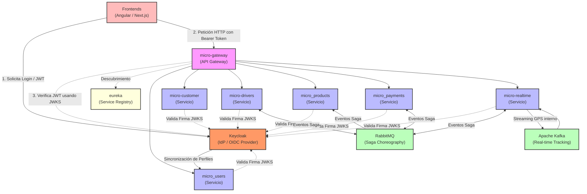
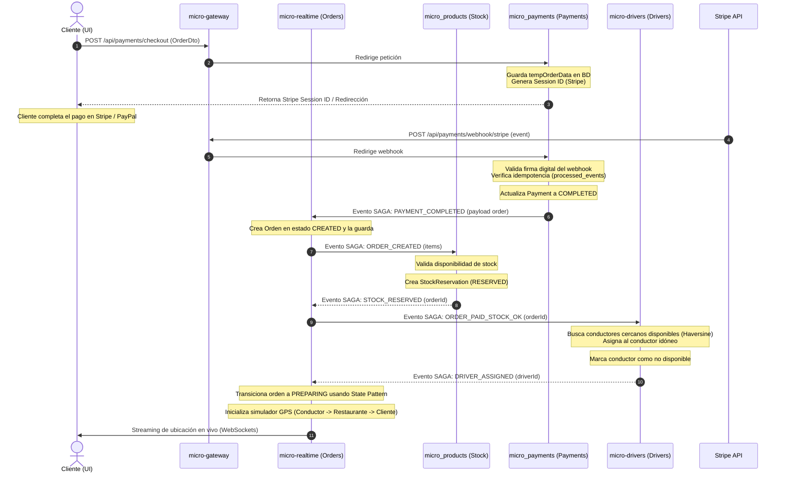
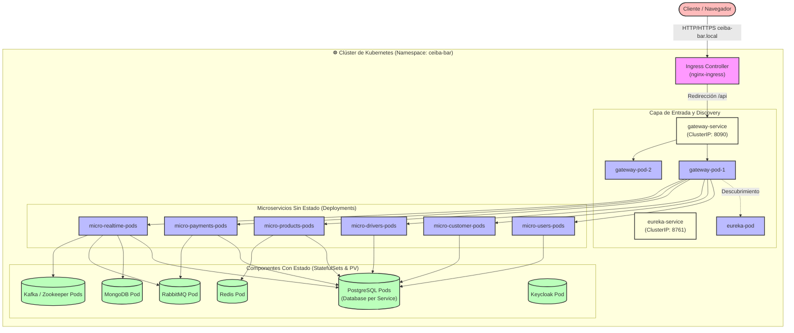

# 📐 Arquitectura de Microservicios y Patrones de Diseño — Ceiba-Bar Delivery v2

Este documento describe la arquitectura global (nivel macro/ecosistema), la arquitectura interna de los servicios (nivel micro/aplicativo), las relaciones y flujos de comunicación entre los microservicios, y los patrones de diseño GoF (*Gang of Four*) implementados en el proyecto **Ceiba-Bar Delivery**, detallando el porqué de cada decisión técnica.

---

## 🗺️ 1. Patrones de Arquitectura Global (Nivel Ecosistema)

A nivel de ecosistema, el proyecto está estructurado bajo una **Arquitectura de Microservicios Descentralizada y Orientada a Eventos**. Los patrones e infraestructura utilizados a este nivel son:



### A. API Gateway Pattern (`micro-gateway`)
*   **Qué es:** Punto de entrada único para todos los clientes (Angular, Next.js). Encapsula la estructura interna del sistema de microservicios.
*   **Por qué se usa:**
    *   **Seguridad unificada:** Valida los tokens JWT de Keycloak en un único sitio, liberando a los microservicios de tener que lidiar con políticas CORS complejas o validación de firmas criptográficas públicas.
    *   **Enrutamiento dinámico:** Redirige las peticiones a la ruta del servicio correspondiente en base al path (ej: `/api/products/**` ➔ `micro_products`).
    *   **Resiliencia:** Implementa filtros globales y Circuit Breakers (Resilience4j) para cortar peticiones si un servicio está colapsado.
    *   **Ocultamiento de topología:** Los clientes nunca conocen las IPs internas ni los puertos reales de los microservicios individuales, lo que mitiga vectores de ataque.

### B. Service Discovery / Registry Pattern (`eureka`)
*   **Qué es:** Un directorio dinámico en tiempo real donde cada microservicio se registra automáticamente al iniciar, indicando su IP, puerto y estado de salud.
*   **Por qué se usa:**
    *   **Auto-escalado:** En Kubernetes o Docker, los contenedores nacen y mueren con IPs dinámicas. Eureka permite que el Gateway y los clientes de OpenFeign localicen los servicios por su nombre lógico (ej. `http://micro-realtime/`) en vez de usar IPs estáticas (*hardcoded*).
    *   **Balanceo de carga del lado del cliente:** OpenFeign e Ingress interrogan al registro y distribuyen la carga equitativamente entre las réplicas disponibles de un microservicio.

### C. Database-per-Service Pattern
*   **Qué es:** Cada microservicio es dueño absoluto de su base de datos. Ningún servicio puede consultar la base de datos de otro directamente por SQL; la comunicación debe ser por HTTP (Feign) o Mensajería (RabbitMQ/Kafka).
*   **Por qué se usa:**
    *   **Desacoplamiento fuerte:** Si el esquema de base de datos de `micro_products` cambia, no rompe el microservicio de órdenes `micro-realtime`, evitando fallos en cascada en despliegues.
    *   **Persistencia políglota:** Nos permite elegir el motor óptimo para cada necesidad: PostgreSQL para transacciones ACID críticas (pagos, órdenes) y MongoDB para flujos rápidos no estructurales (coordenadas GPS de tracking).

### D. Event-Driven Architecture (EDA) & Saga Pattern (Coreografía)
*   **Qué es:** La comunicación transaccional entre múltiples servicios (crear orden ➔ reservar stock ➔ cobrar ➔ asignar conductor) se realiza publicando y consumiendo eventos asíncronos mediante **RabbitMQ** en lugar de llamadas HTTP síncronas bloqueantes.
*   **Por qué se usa:**
    *   **Tolerancia a fallos:** Si el servicio de pagos está caído temporalmente, el mensaje de reserva de stock se encola de forma segura en RabbitMQ. Cuando el servicio vuelve a estar en línea, procesa el pago sin haber perdido la petición del cliente.
    *   **Transacciones distribuidas (Saga por Coreografía):** Cada servicio reacciona a eventos de forma independiente y publica el resultado. Si ocurre un fallo (ej: el pago es rechazado), se ejecutan **eventos de compensación** automáticos (ej: el servicio de productos libera el stock reservado y la orden se marca como cancelada).

---

## 🏛️ 2. Patrones de Arquitectura Aplicativa (Nivel Micro / Interno)

Dentro de cada microservicio individual, se implementan patrones arquitectónicos específicos para garantizar la calidad del código, el rendimiento y la facilidad de mantenimiento:

### A. Capas Tradicionales Orientadas a Dominio (Controller-Service-Repository)
*   **Controller Layer:** Expone la API REST, valida los datos de entrada (`@Valid`) y mapea los Requests a DTOs.
*   **Service Layer:** Alberga la lógica de negocio pura y define los límites transaccionales (`@Transactional`).
*   **Repository Layer:** Abstrae el acceso a los datos utilizando Spring Data JPA / Hibernate o repositorios reactivos de MongoDB.
*   **Por qué se usa:** Proporciona una separación clara de responsabilidades (*Separation of Concerns*). La lógica de negocio no sabe ni le importa si los datos se guardan en Postgres o si se exponen vía REST, WebSockets o gRPC.

### B. CQRS (Command Query Responsibility Segregation) en `micro-realtime`
*   **Qué es:** Separar la lógica y los modelos de escritura (Commands) de la lógica y los modelos de lectura (Queries).
    *   **Escritura (PostgreSQL):** Modifica el estado del pedido, asegurando consistencia atómica mediante transacciones ACID clásicas.
    *   **Lectura (MongoDB):** Provee una colección desnormalizada de sólo lectura (`tracking`) optimizada para búsquedas y streaming de geolocalización ultra rápido.
*   **Por qué se usa:** Las lecturas y escrituras escalan a ritmos muy diferentes. El tracking del conductor requiere miles de escrituras de coordenadas por segundo, mientras que la consulta de la orden es menos frecuente. CQRS evita que las operaciones pesadas de lectura degraden la base de datos de órdenes transaccionales.

### C. Event Sourcing en `micro-realtime`
*   **Qué es:** En lugar de guardar únicamente el estado actual de un pedido, se guarda el historial completo de eventos ocurridos (`OrderEvent` en la tabla `order_events`: `CREATED` ➔ `STOCK_RESERVED` ➔ `PAYMENT_COMPLETED` ➔ `DRIVER_ASSIGNED` ➔ `DELIVERED`).
*   **Por qué se usa:**
    *   **Auditoría perfecta:** Permite reconstruir el estado del pedido en cualquier punto del tiempo para resolver disputas (ej: saber exactamente a qué segundo se le asignó un conductor y cuánto tardó en recoger la comida).
    *   **Consistencia eventual:** Facilita la recuperación del estado ante caídas del sistema simplemente volviendo a procesar la lista de eventos.

### D. Transactional Outbox Pattern (Idempotencia en Mensajería)
*   **Qué es:** En vez de guardar datos en la base de datos y publicar un evento en RabbitMQ en un solo flujo (lo cual puede fallar si RabbitMQ se cae tras escribir en la BD), el evento se inserta en una tabla local `outbox_events` dentro de la **misma transacción** de base de datos que la entidad del negocio.
*   **Por qué se usa:**
    *   **Garantía de entrega "At least once":** Si la transacción pasa, el evento está garantizado de estar guardado en la BD. Un poller independiente (`OutboxPoller`) lee la tabla asíncronamente y lo publica a RabbitMQ, reintentando si el broker no responde, asegurando que ningún evento se pierda jamás.

---

## 🧩 3. Patrones de Diseño implementados (GoF - Gang of Four)

A nivel de código en Java, implementamos patrones GoF clásicos para resolver problemas típicos de diseño de software:

### A. Strategy Pattern (Patrón Estrategia)

#### Caso 1: Pasarelas de Pago (`micro_payments`)
*   **Problema:** La aplicación debe soportar múltiples métodos de cobro (Stripe, PayPal) que tienen integraciones y SDKs completamente distintos, permitiendo añadir otros en el futuro sin modificar la lógica del servicio principal.
*   **Implementación:**
    *   `PaymentGateway` (Interfaz) define el contrato.
    *   `StripeGateway` y `PayPalGateway` (Estrategias concretas) implementan el SDK específico.
    *   `PaymentService` (Contexto) inyecta dinámicamente el mapa de estrategias de Spring y selecciona el gateway correcto en base a un string enviado por el frontend (`method="stripe"` o `method="paypal"`).
*   **Código clave:**
    ```java
    public interface PaymentGateway {
        PaymentResult processPayment(PaymentRequest req);
    }
    ```

#### Caso 2: Asignación de Conductores (`micro-drivers`)
*   **Problema:** La lógica para decidir qué repartidor toma un pedido puede variar (asignar al más cercano, al que tiene mejor rating, o balancear las entregas equitativamente).
*   **Implementación:**
    *   `DriverAssignmentStrategy` define la firma de asignación.
    *   `NearestDriverStrategy` calcula la distancia por fórmula matemática de Haversine desde la posición del conductor hacia el restaurante (`19.4326, -99.1332`) y asigna al más próximo.

---

### B. State Pattern (Patrón Estado)

#### Caso Único: Ciclo de vida de la Orden (`micro-realtime`)
*   **Problema:** Una orden de entrega pasa por una serie de estados secuenciales estrictos (`CREATED` ➔ `PAID` ➔ `PREPARING` ➔ `ON_THE_WAY` ➔ `DELIVERED`). La lógica para avanzar de estado o cancelar la orden es compleja y varía según el estado actual (ej: no puedes cancelar un pedido si ya fue entregado). Llenar el código de sentencias `if-else` o `switch` anidados vuelve el código inmantenible.
*   **Implementación:**
    *   `OrderState` (Interfaz) define los comportamientos: `next(Order order)` y `cancel(Order order)`.
    *   Clases concretas por estado: `CreatedState`, `PreparingState`, `EnCaminoState`, `EntregadoState`, `CanceladoState`. Cada clase sabe exactamente a qué estado transicionar o qué lógica disparar al cancelar.
    *   `OrderStateFactory` entrega el comportamiento de estado correcto de manera dinámica.
*   **Código clave:**
    ```java
    public interface OrderState {
        void next(Order order);
        void cancel(Order order);
    }
    ```

---

### C. Adapter Pattern (Patrón Adaptador)

#### Caso Único: Integración de Geocoding
*   **Problema:** El sistema necesita convertir direcciones físicas a coordenadas decimales (latitud/longitud) para pintar los mapas. Podemos usar servicios gratuitos (como OpenStreetMap Nominatim) o servicios de pago (Google Maps API). No queremos acoplar el código al SDK de ningún proveedor en particular.
*   **Implementación:**
    *   `GeocodingService` define los métodos unificados que el negocio entiende.
    *   `NominatimGeocodingAdapter` y `GoogleMapsGeocodingAdapter` adaptan las clases y APIs de los proveedores externos para que coincidan con la interfaz unificada de nuestra aplicación.

---

### D. Builder Pattern (Patrón Constructor)
*   **Caso de uso:** En todas las entidades de datos y DTOs complejos (especialmente al construir objetos de transacciones y payloads).
*   **Por qué se usa:** Evita tener constructores gigantescos con parámetros posicionales propensos a errores (anti-patrón *Telescoping Constructor*). Permite crear objetos legibles paso a paso, asegurando inmutabilidad.
*   **Código clave:**
    ```java
    Order order = Order.builder()
        .customerId(123L)
        .total(new BigDecimal("250.00"))
        .status(OrderStatus.CREATED)
        .build();
    ```

---

## 🔄 4. Relación e Interacción Paso a Paso (Sequence Diagram)

El siguiente diagrama de secuencia detalla cómo interactúan los microservicios de manera coordinada (Saga por Coreografía) para llevar a cabo el flujo completo de una orden de bar-delivery:



---

## 🛡️ 5. Resiliencia de Microservicios (Resilience4j)

Para evitar que fallos en servicios externos o microservicios lentos causen caídas en todo el sistema, se implementan tres patrones de tolerancia a fallos:

1.  **Circuit Breaker (Cortocircuito):** Si `micro-realtime` intenta llamar a `micro-drivers` por Feign y este falla de forma reiterada (ej: timeout de base de datos), el circuito se **abre**. Las llamadas subsecuentes no intentan tocar el servicio de conductores, sino que devuelven una respuesta de contingencia (*fallback*) instantáneamente, evitando consumir hilos del servidor.
2.  **Retry (Reintentos con Backoff Exponencial):** Al llamar a la pasarela de pagos, si la red falla temporalmente, Resilience4j reintenta la petición hasta 3 veces duplicando el tiempo de espera entre intentos (ej. 500ms, 1s, 2s).
3.  **Bulkhead (Mampara):** Limita el número de hilos concurrentes que pueden llamar a un microservicio específico (ej. máximo 5 llamadas simultáneas al servicio de conductores). Esto garantiza que si el servicio de conductores se ralentiza, no se acaparen todos los recursos del CPU del Gateway, permitiendo que la navegación por el catálogo de productos siga funcionando rápido.

---

## ☸️ 6. Arquitectura de Despliegue en Kubernetes (Orquestación)

Para producción y entornos locales escalados (Minikube), la topología de la aplicación se orquesta utilizando **Kubernetes (K8s)**. A continuación se detalla cómo se organizan los componentes y la red dentro del clúster (mapeado directamente a los manifiestos de la carpeta `k8s/base/`):



### Elementos Clave de la Arquitectura K8s:

1.  **Ingress (`10-ingress.yaml`):**
    *   Actúa como el balanceador de carga externo del clúster. Recibe el tráfico HTTP/HTTPS exterior (mapeado al dominio `ceiba-bar.local`) y lo redirige internamente hacia el servicio `gateway-service` en base a reglas de Host y Path.
2.  **Deployments (Servicios Stateless):**
    *   Utilizados para el Gateway, Eureka, los Frontends, y los microservicios core. K8s se encarga de mantener el número deseado de réplicas en ejecución (`replicas: 2`). Si un Pod muere o falla un Probe de salud (Liveness), Kubernetes lo destruye y crea uno nuevo instantáneamente.
3.  **StatefulSets (Servicios con Estado - `03-databases.yaml` & `04-messaging.yaml`):**
    *   Utilizados para bases de datos (PostgreSQL, MongoDB, Redis) y brokers de mensajería (RabbitMQ, Kafka). A diferencia de los Deployments, los StatefulSets asignan identificadores únicos y persistentes a cada Pod (ej: `postgres-0`, `postgres-1`) y enlazan cada Pod a un almacenamiento físico dedicado mediante **PersistentVolumeClaims (PVC)**, garantizando que los datos no se borren cuando un Pod se reinicia.
4.  **Services (ClusterIP & Headless):**
    *   Definen IPs virtuales estables dentro del clúster para permitir la comunicación interna. Los microservicios sin estado se exponen mediante `ClusterIP` para balancear las llamadas internas de Feign, mientras que bases de datos y sistemas de mensajería que requieren comunicación par-a-par (ej. Kafka) usan servicios `Headless` (sin balanceador) para conectarse directamente a cada réplica de base de datos específica.
5.  **ConfigMaps y Secrets (`01-secrets.yaml` & `02-configmaps.yaml`):**
    *   Inyectan configuraciones y variables de entorno comunes a todos los contenedores de forma centralizada y segura, abstrayendo contraseñas y claves de Stripe/PayPal de las imágenes de Docker.

