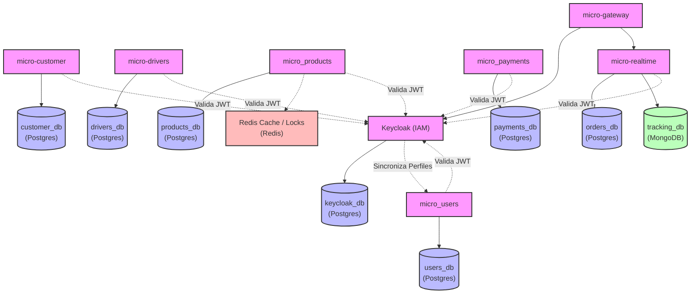

# 🗄️ Arquitectura de Bases de Datos — Ceiba-Bar Delivery v2

Este documento detalla la arquitectura de persistencia del proyecto **Ceiba-Bar Delivery**, detallando la separación de bases de datos por microservicio (patrón *Database-per-Service*), la distinción entre almacenamiento **SQL (relacional)** y **NoSQL (no relacional)**, los esquemas de tablas/colecciones con sus respectivos campos y tipos de datos, y las relaciones físicas y lógicas que unen a los componentes.

---

## 🗺️ Mapa General de Persistencia

El proyecto sigue el patrón **Database-per-Service** para garantizar el acoplamiento débil entre microservicios. Adicionalmente, implementa un enfoque de **Persistencia Políglota**, usando bases de datos SQL relacionales (PostgreSQL) para datos transaccionales con integridad referencial rígida y bases de datos NoSQL (MongoDB y Redis) para eventos de alta frecuencia, simulación de geolocalización y caché distribuida.

### Tabla Resumen de Persistencia

| Microservicio | Base de Datos / Almacén | Motor de BD | Tipo | Propósito Principal |
| :--- | :--- | :--- | :--- | :--- |
| `micro_users` | `users_db` | PostgreSQL | **SQL** | Sincronización y perfiles básicos de usuarios desde Keycloak. |
| `keycloak` | `keycloak_db` | PostgreSQL | **SQL** | Almacenamiento nativo de Keycloak (usuarios, credenciales, roles, realms). |
| `micro-customer` | `customer_db` | PostgreSQL | **SQL** | Información de perfiles de clientes y libreta de direcciones. |
| `micro-drivers` | `drivers_db` | PostgreSQL | **SQL** | Perfiles de conductores, placas, disponibilidad y asignaciones pendientes. |
| `micro_products` | `products_db` | PostgreSQL | **SQL** | Catálogo de productos, menús, zonas geográficas de envío y reservas de stock. |
| `micro_payments` | `payments_db` | PostgreSQL | **SQL** | Transacciones de cobro de Stripe/PayPal e historial de reembolsos. |
| `micro-realtime` | `orders_db` | PostgreSQL | **SQL** | Órdenes de compra, ítems del pedido, entregas activas y eventos de auditoría (Saga). |
| `micro-realtime` | `tracking_db` (col: `tracking`) | MongoDB | **NoSQL** | Coordenadas de geolocalización en tiempo real (GPS) enviadas por los conductores. |
| `micro_products` | Caché & Locks | Redis | **NoSQL** | Caché de catálogo de productos/menús y bloqueos distribuidos. |

---

## 🔌 Diagrama de Arquitectura de Datos (Servicio ➔ BD)



---

## 📐 Diagrama de Relaciones Lógicas (Entity-Relationship Cross-Service)

Dado que las bases de datos están aisladas físicamente, **no existen llaves foráneas físicas (`FOREIGN KEY`) entre tablas de diferentes microservicios**. En su lugar, el sistema implementa **llaves lógicas cruzadas** (típicamente UUIDs de usuarios o IDs autoincrementales propagados mediante eventos en RabbitMQ/Kafka).

```mermaid
erDiagram
    %% ==========================================
    %% 1. USERS & KEYCLOAK (Relación Lógica)
    %% ==========================================
    "Keycloak Users (keycloak_db)" {
        string id_keycloak PK "UUID nativo de Keycloak"
        string username
        string email
    }
    
    "users (users_db)" {
        string id PK "UUID (Sincronizado de Keycloak)"
        string name
        string lastname
        string email
        string password
        bigint phone
        string image
        string role "ADMIN | CUSTOMER | DRIVER | RESTAURANT"
    }

    "Keycloak Users (keycloak_db)" ||--|| "users (users_db)" : "Sincroniza perfil (1:1)"

    %% ==========================================
    %% 2. CUSTOMER DATABASE
    %% ==========================================
    "customers (customer_db)" {
        bigint id PK "autoincrement"
        string user_id FK "UUID lógico de users"
        string user_email
        int total_orders
        double total_spent
        timestamp member_since
        timestamp last_order_date
        timestamp created_at
        timestamp updated_at
    }

    "addresses (customer_db)" {
        bigint id PK "autoincrement"
        string alias
        string street
        string colonia
        string city
        string state
        string delegacion
        string postal_code
        string instructions
        boolean is_default
        double latitude
        double longitude
        timestamp created_at
        timestamp updated_at
    }

    "customer_addresses (customer_db)" {
        bigint customer_id PK,FK
        bigint address_id PK,FK
    }

    "users (users_db)" ||--|o "customers (customer_db)" : "user_id (1:1)"
    "customers (customer_db)" ||--o{ "customer_addresses (customer_db)" : ""
    "addresses (customer_db)" ||--o{ "customer_addresses (customer_db)" : ""

    %% ==========================================
    %% 3. DRIVERS DATABASE
    %% ==========================================
    "drivers (drivers_db)" {
        bigint id PK "autoincrement"
        string user_id FK "UUID lógico de users"
        string user_email
        string moto_id
        string license_plate
        string license_number
        double rating
        int total_deliveries
        timestamp registration_date
        double current_latitude
        double current_longitude
        boolean available
    }

    "pending_assignments (drivers_db)" {
        bigint id PK "autoincrement"
        bigint order_id FK "ID lógico de orders"
        text payload "JSON completo"
        timestamp created_at
    }

    "users (users_db)" ||--|o "drivers (drivers_db)" : "user_id (1:1)"

    %% ==========================================
    %% 4. PRODUCTS DATABASE
    %% ==========================================
    "menus (products_db)" {
        bigint id PK "autoincrement"
        string name
        string description
        boolean active
        string type "DESAYUNO | ALMUERZO | etc"
        time available_from
        time available_until
        timestamp created_at
        timestamp updated_at
    }

    "menu_available_days (products_db)" {
        bigint menu_id PK,FK
        string day_of_week PK
    }

    "products (products_db)" {
        bigint id PK "autoincrement"
        bigint menu_id FK
        string name
        string description
        double price
        string image
        boolean available
        timestamp created_at
        timestamp updated_at
    }

    "drinks (products_db)" {
        bigint product_id PK,FK "JOINED Inheritance"
        string type "ALCOHOLIC | NON_ALCOHOLIC"
    }

    "snacks (products_db)" {
        bigint product_id PK,FK "JOINED Inheritance"
    }

    "stock_reservations (products_db)" {
        bigint id PK "autoincrement"
        bigint order_id FK "ID lógico de orders"
        bigint product_id FK
        int quantity
        string status "RESERVED | CONFIRMED | etc"
        timestamp expires_at
        timestamp created_at
        timestamp updated_at
    }

    "delivery_zones (products_db)" {
        bigint id PK "autoincrement"
        string name
        double center_latitude
        double center_longitude
        double radius_km
        decimal delivery_fee
        int estimated_minutes
        boolean active
        timestamp created_at
        timestamp updated_at
    }

    "menus (products_db)" ||--o{ "menu_available_days (products_db)" : ""
    "menus (products_db)" ||--o{ "products (products_db)" : ""
    "products (products_db)" ||--|o "drinks (products_db)" : "JOINED (1:1)"
    "products (products_db)" ||--|o "snacks (products_db)" : "JOINED (1:1)"
    "products (products_db)" ||--o{ "stock_reservations (products_db)" : "product_id"

    %% ==========================================
    %% 5. PAYMENTS DATABASE
    %% ==========================================
    "payments (payments_db)" {
        bigint id PK "autoincrement"
        bigint order_id FK "ID lógico de orders"
        bigint customer_id FK "ID lógico de customers"
        decimal amount
        string currency
        string method "STRIPE | PAYPAL"
        string status "PENDING | COMPLETED | etc"
        string transaction_id
        string idempotency_key
        string receipt_url
        decimal refund_amount
        string refund_reason
        timestamp refunded_at
        text temp_order_data "JSON para reconstrucción"
        string stripe_session_id
        string stripe_payment_intent_id
        string paypal_order_id
        string paypal_payer_id
        string paypal_capture_id
        timestamp created_at
        timestamp updated_at
    }

    "processed_events (payments_db)" {
        string event_id PK "ID (Stripe: evt_xxx / PayPal: WH-xxx)"
        string provider "STRIPE | PAYPAL"
        timestamp processed_at
    }

    %% ==========================================
    %% 6. ORDERS & DELIVERIES (micro-realtime)
    %% ==========================================
    "orders (orders_db)" {
        bigint id PK "autoincrement"
        bigint customer_id FK "ID lógico de customers"
        string user_id FK "UUID lógico de users"
        string customer_name
        string customer_email
        bigint driver_id FK "ID lógico de drivers"
        string status "CREATED | PAID | etc"
        string street "deliveryAddress EMBEDDED"
        string colonia "deliveryAddress EMBEDDED"
        string city "deliveryAddress EMBEDDED"
        string postal_code "deliveryAddress EMBEDDED"
        string reference "deliveryAddress EMBEDDED"
        double delivery_latitude
        double delivery_longitude
        decimal subtotal
        decimal delivery_fee
        decimal discount
        decimal tip
        decimal total
        string payment_method
        string notes
        int rating
        string feedback
        timestamp rated_at
        timestamp delivered_at
        timestamp created_at
        timestamp updated_at
    }

    "order_items (orders_db)" {
        bigint id PK "autoincrement"
        bigint order_id FK
        bigint product_id FK "ID lógico de products"
        string product_name
        string product_image
        decimal unit_price
        int quantity
        decimal subtotal
        timestamp created_at
        timestamp updated_at
    }

    "deliveries (orders_db)" {
        bigint id PK "autoincrement"
        bigint order_id FK "1:1 Relation"
        bigint driver_id FK "ID lógico de drivers"
        timestamp assigned_at
        timestamp started_at
        timestamp completed_at
        double delivery_latitude
        double delivery_longitude
        double pickup_latitude
        double pickup_longitude
        text notes
        string status "ASSIGNED | PREPARING | etc"
        timestamp created_at
        timestamp updated_at
    }

    "order_events (orders_db)" {
        bigint id PK "autoincrement"
        bigint order_id FK
        string event_type "CREATED | DRIVER_ASSIGNED | etc"
        text payload "JSON"
        string triggered_by "userId | SYSTEM"
        timestamp occurred_at
    }

    "orders (orders_db)" ||--o{ "order_items (orders_db)" : ""
    "orders (orders_db)" ||--|o "deliveries (orders_db)" : "1:1"
    "orders (orders_db)" ||--o{ "order_events (orders_db)" : ""

    %% Relaciones Lógicas Cruzadas
    "customers (customer_db)" ||--o{ "orders (orders_db)" : "customer_id"
    "drivers (drivers_db)" ||--o{ "orders (orders_db)" : "driver_id"
    "drivers (drivers_db)" ||--o{ "deliveries (orders_db)" : "driver_id"
    "orders (orders_db)" ||--|| "payments (payments_db)" : "order_id (1:1)"
    "orders (orders_db)" ||--o{ "stock_reservations (products_db)" : "order_id"
    "orders (orders_db)" ||--|o "pending_assignments (drivers_db)" : "order_id"

    %% ==========================================
    %% 7. TRACKING MONGO DATABASE (NoSQL)
    %% ==========================================
    "tracking (tracking_db MongoDB)" {
        string id PK "ObjectId hex"
        bigint orderId FK "ID lógico de orders"
        string status
        string driverId FK "UUID lógico de users/drivers"
        timestamp timestamp
        double lat
        double lng
        double deliveryLat
        double deliveryLng
    }

    "orders (orders_db)" ||--o{ "tracking (tracking_db MongoDB)" : "orderId (1:N)"
```



---

## 📋 Diccionario de Esquemas y Campos (SQL)

### 1. `users_db` (Servicio: `micro_users`)
Almacena la información de los usuarios sincronizados de la cuenta central de Keycloak tras su registro.

#### Tabla: `users`
*   `id` (`VARCHAR(255)` - **PRIMARY KEY**): UUID del usuario, mapeado exactamente de la propiedad `sub` (Subject) de Keycloak.
*   `name` (`VARCHAR(100)`): Nombre(s) del usuario.
*   `lastname` (`VARCHAR(100)`): Apellido(s) del usuario.
*   `email` (`VARCHAR(255)` - **UNIQUE**): Correo electrónico único del usuario.
*   `password` (`VARCHAR(255)`): Contraseña cifrada (usada únicamente para fallback local de desarrollo).
*   `phone` (`BIGINT`): Teléfono de contacto.
*   `image` (`VARCHAR(500)`): URL de la foto de perfil en el bucket del servicio.
*   `role` (`VARCHAR(50)`): Rol asignado (`ROLE_ADMIN`, `ROLE_CUSTOMER`, `ROLE_DRIVER`, `ROLE_RESTAURANT`).
*   `created_at` (`TIMESTAMP`): Fecha de creación en base de datos.
*   `updated_at` (`TIMESTAMP`): Fecha de última modificación.

---

### 2. `customer_db` (Servicio: `micro-customer`)
Almacena estadísticas de fidelidad del cliente y las direcciones físicas registradas.

#### Tabla: `customers`
*   `id` (`BIGINT` - **PRIMARY KEY** - **SERIAL**): ID autoincremental del perfil del cliente.
*   `user_id` (`VARCHAR(255)` - **UNIQUE**): UUID referencial del usuario en `users_db`.
*   `user_email` (`VARCHAR(255)` - **UNIQUE**): Email duplicado con fines históricos de consulta rápida.
*   `total_orders` (`INTEGER`): Número de pedidos completados por el cliente (Default `0`).
*   `total_spent` (`DOUBLE PRECISION`): Total histórico de dinero gastado (Default `0.0`).
*   `member_since` (`TIMESTAMP`): Fecha en la que se registró como cliente.
*   `last_order_date` (`TIMESTAMP`): Fecha del último pedido realizado.
*   `created_at` (`TIMESTAMP`): Fecha de creación en auditoría.
*   `updated_at` (`TIMESTAMP`): Fecha de última modificación en auditoría.

#### Tabla: `addresses`
*   `id` (`BIGINT` - **PRIMARY KEY** - **SERIAL**): ID autoincremental de la dirección.
*   `alias` (`VARCHAR(100)`): Alias identificador (Ej: "Casa", "Oficina", "Novia").
*   `street` (`VARCHAR(255)`): Calle y número exterior/interior.
*   `colonia` (`VARCHAR(255)`): Colonia/Barrio.
*   `city` (`VARCHAR(100)`): Ciudad de residencia.
*   `state` (`VARCHAR(100)`): Estado federativo.
*   `delegacion` (`VARCHAR(100)`): Municipio o alcaldía.
*   `postal_code` (`VARCHAR(20)`): Código postal.
*   `instructions` (`TEXT`): Notas adicionales de localización (Ej: "Rejas negras").
*   `is_default` (`BOOLEAN`): Bandera para indicar la dirección de entrega predilecta (Default `false`).
*   `latitude` (`DOUBLE PRECISION`): Coordenada decimal de latitud.
*   `longitude` (`DOUBLE PRECISION`): Coordenada decimal de longitud.
*   `created_at` (`TIMESTAMP`): Fecha de auditoría.
*   `updated_at` (`TIMESTAMP`): Fecha de auditoría.

#### Tabla de Unión: `customer_addresses`
*   `customer_id` (`BIGINT` - **PRIMARY KEY** / **FOREIGN KEY**): Referencia a `customers(id)`.
*   `address_id` (`BIGINT` - **PRIMARY KEY** / **FOREIGN KEY**): Referencia a `addresses(id)`.

---

### 3. `drivers_db` (Servicio: `micro-drivers`)
Almacena el estado de los conductores de la flotilla de reparto, su ubicación física actual y las solicitudes de reparto en cola.

#### Tabla: `drivers`
*   `id` (`BIGINT` - **PRIMARY KEY** - **SERIAL**): ID de control interno del conductor.
*   `user_id` (`VARCHAR(255)` - **UNIQUE**): UUID referencial del usuario en `users_db`.
*   `user_email` (`VARCHAR(255)`): Email duplicado para visualización rápida en UI.
*   `moto_id` (`VARCHAR(100)`): Identificador interno del vehículo (Ej: "MOTO-04").
*   `license_plate` (`VARCHAR(50)`): Placa del vehículo.
*   `license_number` (`VARCHAR(100)`): Número de licencia de conducir.
*   `rating` (`DOUBLE PRECISION`): Promedio histórico de satisfacción del conductor (Default `0.0`).
*   `total_deliveries` (`INTEGER`): Pedidos completados por este repartidor.
*   `registration_date` (`TIMESTAMP`): Fecha de alta del conductor.
*   `current_latitude` (`DOUBLE PRECISION`): Última posición de latitud conocida del conductor.
*   `current_longitude` (`DOUBLE PRECISION`): Última posición de longitud conocida del conductor.
*   `available` (`BOOLEAN`): Define si el conductor está libre para asignación (Default `true`).

#### Tabla: `pending_assignments`
*   `id` (`BIGINT` - **PRIMARY KEY** - **SERIAL**): Identificador único de encolamiento.
*   `order_id` (`BIGINT` - **UNIQUE**): ID lógico de la orden pendiente de asignación.
*   `payload` (`TEXT`): Serialización JSON de los datos del pedido que serán entregados al repartidor seleccionado.
*   `created_at` (`TIMESTAMP`): Marca de tiempo de cuándo entró a la cola.

---

### 4. `products_db` (Servicio: `micro_products`)
Implementa la herencia a nivel de tablas relacionales (estrategia **JOINED**) para modelar el menú y los productos.

#### Tabla: `menus`
*   `id` (`BIGINT` - **PRIMARY KEY** - **SERIAL**): Identificador único del menú.
*   `name` (`VARCHAR(100)`): Título del menú (Ej: "Menú Nocturno", "Happy Hour").
*   `description` (`VARCHAR(500)`): Detalles del menú.
*   `active` (`BOOLEAN`): Disponibilidad global del menú.
*   `type` (`VARCHAR(50)`): Tipo de servicio (`DESAYUNO`, `ALMUERZO`, `CENA`, `HAPPY_HOUR`, `ESPECIAL`).
*   `available_from` (`TIME`): Hora de apertura de venta (Ej: `18:00:00`).
*   `available_until` (`TIME`): Hora de cierre de venta (Ej: `02:00:00`).
*   `created_at` (`TIMESTAMP`), `updated_at` (`TIMESTAMP`): Auditoría.

#### Tabla de Elemento Colección: `menu_available_days`
*   `menu_id` (`BIGINT` - **PRIMARY KEY** / **FOREIGN KEY**): Referencia a `menus(id)`.
*   `day_of_week` (`VARCHAR(50)` - **PRIMARY KEY**): Día de la semana en la que este menú está activo (Ej: `MONDAY`, `TUESDAY`).

#### Tabla Base: `products`
*   `id` (`BIGINT` - **PRIMARY KEY** - **SERIAL**): ID único del producto.
*   `menu_id` (`BIGINT` - **FOREIGN KEY**): Enlace opcional a un `menus(id)`.
*   `name` (`VARCHAR(150)`): Nombre comercial del platillo/bebida.
*   `description` (`VARCHAR(1000)`): Descripción de ingredientes y porción.
*   `price` (`DOUBLE PRECISION`): Costo de venta al público en MXN.
*   `image` (`VARCHAR(500)`): URL de la imagen en MinIO/S3.
*   `available` (`BOOLEAN`): Bandera de existencia física en almacén (Default `true`).
*   `created_at` (`TIMESTAMP`), `updated_at` (`TIMESTAMP`): Auditoría.

#### Tabla Hija: `drinks`
*   `product_id` (`BIGINT` - **PRIMARY KEY** / **FOREIGN KEY**): Mapea directamente al `id` de `products` mediante relación `One-to-One` automática.
*   `type` (`VARCHAR(50)`): Clasificación de la bebida (`ALCOHOLIC` | `NON_ALCOHOLIC`).

#### Tabla Hija: `snacks`
*   `product_id` (`BIGINT` - **PRIMARY KEY** / **FOREIGN KEY**): Mapea al `id` de `products`. No posee campos extra, actúa como marcador semántico.

#### Tabla: `stock_reservations` (Saga Pattern)
*   `id` (`BIGINT` - **PRIMARY KEY** - **SERIAL**): Identificador de la reserva.
*   `order_id` (`BIGINT`): ID del pedido en proceso.
*   `product_id` (`BIGINT`): Producto reservado.
*   `quantity` (`INTEGER`): Cantidad de ítems reservados.
*   `status` (`VARCHAR(50)`): Estado de la reserva (`RESERVED`, `CONFIRMED`, `RELEASED`, `EXPIRED`).
*   `expires_at` (`TIMESTAMP`): Tiempo máximo para concretar el cobro antes de liberar el inventario automáticamente.
*   `created_at` (`TIMESTAMP`), `updated_at` (`TIMESTAMP`): Auditoría.

#### Tabla: `delivery_zones`
*   `id` (`BIGINT` - **PRIMARY KEY** - **SERIAL**)
*   `name` (`VARCHAR(150)`): Nombre de la zona (Ej: "Zona Condesa").
*   `center_latitude` (`DOUBLE PRECISION`), `center_longitude` (`DOUBLE PRECISION`): Centro del círculo de cobertura.
*   `radius_km` (`DOUBLE PRECISION`): Radio de cobertura en kilómetros.
*   `delivery_fee` (`NUMERIC(10, 2)`): Tarifa de envío para esta zona en específico.
*   `estimated_minutes` (`INTEGER`): Tiempo estimado promedio de entrega.
*   `active` (`BOOLEAN`): Estado operacional de la zona.
*   `created_at` (`TIMESTAMP`), `updated_at` (`TIMESTAMP`): Auditoría.

---

### 5. `payments_db` (Servicio: `micro_payments`)
Registra las transacciones financieras contra Stripe y PayPal y administra el flujo asíncrono de los webhooks de pago.

#### Tabla: `payments`
*   `id` (`BIGINT` - **PRIMARY KEY** - **SERIAL**): Identificador interno del pago.
*   `order_id` (`BIGINT`): Referencia cruzada de la orden en `orders_db`.
*   `customer_id` (`BIGINT`): ID del cliente pagador.
*   `amount` (`NUMERIC(10, 2)`): Cantidad cobrada.
*   `currency` (`VARCHAR(10)`): Moneda (MXN por defecto).
*   `method` (`VARCHAR(50)`): Método elegido (`STRIPE` o `PAYPAL`).
*   `status` (`VARCHAR(50)`): Estado actual (`PENDING`, `PROCESSING`, `COMPLETED`, `FAILED`, `REFUNDED`, `PARTIALLY_REFUNDED`).
*   `transaction_id` (`VARCHAR(255)`): Identificador retornado por Stripe (PaymentIntent ID) o PayPal (Capture ID).
*   `idempotency_key` (`VARCHAR(255)`): UUID enviado en el header del request para evitar transacciones repetidas.
*   `receipt_url` (`VARCHAR(1000)`): Link público al recibo en formato PDF provisto por la pasarela.
*   `refund_amount` (`NUMERIC(10, 2)`): Cantidad devuelta al cliente en caso de cancelación o reembolso.
*   `refund_reason` (`VARCHAR(255)`): Motivo de la devolución.
*   `refunded_at` (`TIMESTAMP`): Fecha del reembolso.
*   `temp_order_data` (`TEXT`): Serialización JSON del DTO completo del pedido (`OrderDto`), almacenado temporalmente durante el checkout seguro para poder recrearlo tras el callback exitoso del Webhook.
*   `stripe_session_id` (`VARCHAR(255)`): ID de la sesión de checkout generada en Stripe.
*   `stripe_payment_intent_id` (`VARCHAR(255)`): Identificador interno de transacción de Stripe.
*   `paypal_order_id` (`VARCHAR(255)`): ID temporal de orden generado en PayPal Checkout.
*   `paypal_payer_id` (`VARCHAR(255)`): ID del usuario comprador de PayPal.
*   `paypal_capture_id` (`VARCHAR(255)`): ID de captura de fondos en PayPal.
*   `created_at` (`TIMESTAMP`), `updated_at` (`TIMESTAMP`): Auditoría.

#### Tabla: `processed_events`
*   `event_id` (`VARCHAR(255)` - **PRIMARY KEY**): UUID del evento enviado por Stripe (`evt_xxx`) o PayPal (`WH-xxx`) (usado como seguro de de-duplicación contra entregas duplicadas de webhooks).
*   `provider` (`VARCHAR(50)`): Proveedor de pagos (`STRIPE` o `PAYPAL`).
*   `processed_at` (`TIMESTAMP`): Fecha y hora del procesamiento del webhook.

---

### 6. `orders_db` (Servicio: `micro-realtime` / Persistencia SQL)
Contiene la base operacional de las transacciones de negocio más críticas de la plataforma.

#### Tabla: `orders`
*   `id` (`BIGINT` - **PRIMARY KEY** - **SERIAL**): Identificador de la orden.
*   `customer_id` (`BIGINT`): ID referencial del cliente en `customer_db`.
*   `user_id` (`VARCHAR(255)`): UUID de Keycloak del comprador.
*   `customer_name` (`VARCHAR(255)`): Nombre denormalizado del cliente en el momento del pedido.
*   `customer_email` (`VARCHAR(255)`): Email denormalizado para envío de facturas y notificaciones.
*   `driver_id` (`BIGINT`): ID de conductor asignado en `drivers_db`.
*   `status` (`VARCHAR(50)`): Estado de la orden transicionado por el patrón State (`CREATED`, `PAID`, `PREPARING`, `ON_THE_WAY`, `DELIVERED`, `CANCELLED`, `REFUNDED`).
*   **Campos Embebidos (`DeliveryAddress`):**
    *   `street` (`VARCHAR(255)`): Calle.
    *   `colonia` (`VARCHAR(255)`): Colonia.
    *   `city` (`VARCHAR(100)`): Ciudad.
    *   `postal_code` (`VARCHAR(20)`): Código postal.
    *   `reference` (`VARCHAR(500)`): Notas del lugar físico.
*   `delivery_latitude` (`DOUBLE PRECISION`): Latitud de entrega.
*   `delivery_longitude` (`DOUBLE PRECISION`): Longitud de entrega.
*   `subtotal` (`NUMERIC(10, 2)`): Suma total de los productos comprados.
*   `delivery_fee` (`NUMERIC(10, 2)`): Tarifa cobrada por el envío.
*   `discount` (`NUMERIC(10, 2)`): Descuento total aplicado.
*   `tip` (`NUMERIC(10, 2)`): Propina voluntaria para el repartidor.
*   `total` (`NUMERIC(10, 2)`): Pago total neto (`subtotal + delivery_fee + tip - discount`).
*   `payment_method` (`VARCHAR(50)`): Método seleccionado (`stripe` | `paypal`).
*   `notes` (`VARCHAR(1000)`): Notas del cliente al restaurante.
*   `rating` (`INTEGER`): Calificación de 1 a 5 estrellas dada por el cliente a la entrega.
*   `feedback` (`VARCHAR(1000)`): Comentario sobre la comida o el servicio.
*   `rated_at` (`TIMESTAMP`): Fecha de evaluación del servicio.
*   `delivered_at` (`TIMESTAMP`): Fecha exacta de entrega al cliente.
*   `created_at` (`TIMESTAMP`), `updated_at` (`TIMESTAMP`): Auditoría.

#### Tabla: `order_items`
*   `id` (`BIGINT` - **PRIMARY KEY** - **SERIAL**): ID único del registro.
*   `order_id` (`BIGINT` - **FOREIGN KEY**): Referencia a `orders(id)`.
*   `product_id` (`BIGINT`): ID referencial lógico en `products_db`.
*   `product_name` (`VARCHAR(255)`): Nombre del producto denormalizado (por si el restaurante cambia el menú en el futuro).
*   `product_image` (`VARCHAR(500)`): Enlace a la imagen para el historial del pedido.
*   `unit_price` (`NUMERIC(10, 2)`): Precio unitario en el momento de la venta.
*   `quantity` (`INTEGER`): Cantidad ordenada de este ítem.
*   `subtotal` (`NUMERIC(10, 2)`): Costo acumulado (`unit_price * quantity`).
*   `created_at` (`TIMESTAMP`), `updated_at` (`TIMESTAMP`): Auditoría.

#### Tabla: `deliveries`
*   `id` (`BIGINT` - **PRIMARY KEY** - **SERIAL**): ID de control del delivery.
*   `order_id` (`BIGINT` - **UNIQUE** - **FOREIGN KEY**): Relación uno a uno física con la orden (`orders(id)`).
*   `driver_id` (`BIGINT`): Conductor asignado lógicamente.
*   `assigned_at` (`TIMESTAMP`): Fecha y hora en la que el conductor tomó el viaje.
*   `started_at` (`TIMESTAMP`): Hora en la que se recogió la comida en el bar/restaurante.
*   `completed_at` (`TIMESTAMP`): Hora en la que el conductor pulsó el botón de "Entrega Completada".
*   `delivery_latitude` (`DOUBLE PRECISION`), `delivery_longitude` (`DOUBLE PRECISION`): Coordenadas geográficas finales de destino.
*   `pickup_latitude` (`DOUBLE PRECISION`), `pickup_longitude` (`DOUBLE PRECISION`): Coordenadas geográficas del punto de recolección (restaurante).
*   `notes` (`TEXT`): Instrucciones para el repartidor.
*   `status` (`VARCHAR(50)`): Estado de la entrega (`ASSIGNED`, `PREPARING`, `PICKED_UP`, `ON_THE_WAY`, `DELIVERED`).
*   `created_at` (`TIMESTAMP`), `updated_at` (`TIMESTAMP`): Auditoría.

#### Tabla: `order_events` (Audit / Event Sourcing)
*   `id` (`BIGINT` - **PRIMARY KEY** - **SERIAL**)
*   `order_id` (`BIGINT` - **FOREIGN KEY**): Referencia a la orden relacionada.
*   `event_type` (`VARCHAR(100)`): Tipo de evento registrado (`CREATED`, `INVENTORY_RESERVED`, `PAYMENT_COMPLETED`, `DRIVER_ASSIGNED`, `DELIVERED`, `CANCELLED`, etc.).
*   `payload` (`TEXT`): Datos extendidos en formato JSON de la transacción o los actores.
*   `triggered_by` (`VARCHAR(255)`): UUID del usuario o `"SYSTEM"` si fue automático.
*   `occurred_at` (`TIMESTAMP`): Fecha exacta del suceso.

---

### 7. Tabla Común Transaccional: `outbox_events`
*(Esta tabla existe en: `drivers_db`, `products_db`, `payments_db` y `orders_db`)*

Implementa el **Transactional Outbox Pattern** para evitar inconsistencias en la mensajería distribuida asíncrona de RabbitMQ.

*   `id` (`BIGINT` - **PRIMARY KEY** - **SERIAL**): ID único del evento en cola local.
*   `aggregate_type` (`VARCHAR(100)`): Tipo de entidad agrupada (Ej: `"Order"`, `"Payment"`, `"Product"`, `"Driver"`).
*   `aggregate_id` (`BIGINT`): ID de la entidad afectada en la base de datos local del microservicio.
*   `event_type` (`VARCHAR(150)`): Nombre lógico del evento (Ej: `"ORDEN_CREADA"`, `"STOCK_RESERVED"`, `"PAYMENT_OK"`, `"DRIVER_ASSIGNED"`).
*   `payload` (`TEXT`): Contenido serializado en JSON con toda la información necesaria para el consumidor del evento.
*   `status` (`VARCHAR(50)`): Estado de procesamiento del poller local (`PENDING`, `SENT`, `FAILED`).
*   `created_at` (`TIMESTAMP`): Fecha de encolado del evento.
*   `sent_at` (`TIMESTAMP`): Fecha de entrega del evento a RabbitMQ.
*   `retry_count` (`INTEGER`): Número de reintentos fallidos en caso de indisponibilidad de la mensajería (Default `0`).

---

## ⚡ Estructura NoSQL (MongoDB - `tracking_db`)

El rastreo geográfico en tiempo real de los repartidores maneja un flujo de escritura extremadamente alto y volátil (actualizaciones de GPS cada 3 a 5 segundos por conductor activo). El almacenamiento relacional en PostgreSQL degradaría el rendimiento de base de datos rápidamente debido al bloqueo de filas. 

Por esto, las ubicaciones geográficas en tiempo real se almacenan en una base de datos **NoSQL** orientada a documentos (MongoDB) optimizada para inserciones masivas de escrituras sin bloqueos de transacciones complejas.

### Colección: `tracking`

Alberga documentos estructurados en formato BSON. Cada entrada representa un instante en la simulación de ruta del repartidor.

#### Estructura del Documento JSON
```json
{
  "_id": { "$oid": "6682fa07d4b4a1234567890a" },
  "orderId": 45,
  "status": "ON_THE_WAY",
  "driverId": "87564d-7a65-473e-b25c-dd19d6",
  "timestamp": { "$date": "2026-07-01T15:53:05.120Z" },
  "lat": 19.432607,
  "lng": -99.133209,
  "deliveryLat": 19.428405,
  "deliveryLng": -99.127503
}
```

*   `_id` (`ObjectId` - **NoSQL PRIMARY KEY**): Clave única autogenerada de MongoDB basada en timestamp, máquina e incremento de proceso.
*   `orderId` (`NumberLong` - **Logical Index**): El identificador de la orden que el conductor está repartiendo.
*   `status` (`String`): Estado operacional de la orden (`PREPARING`, `DRIVER_ARRIVING`, `PICKED_UP`, `ON_THE_WAY`).
*   `driverId` (`String`): UUID del conductor asignado.
*   `timestamp` (`Date`): Estampa de tiempo exacta de la coordenada capturada.
*   `lat` (`Double`), `lng` (`Double`): Ubicación de geolocalización actual (coordenada GPS decimal del repartidor).
*   `deliveryLat` (`Double`), `deliveryLng` (`Double`): Coordenadas de destino final (dirección del cliente) para trazar rutas y distancias.

---

## 🔑 Base de Datos NoSQL Key-Value (Redis)

Redis funciona como un motor **NoSQL tipo Llave-Valor** hospedado en memoria RAM de acceso ultrarrápido (sub-milisegundo). Sus responsabilidades se dividen en:

1.  **Caché Distribuida de Catálogos (Microservicio: `micro_products`)**:
    *   **Estrategia**: *Cache-Aside*.
    *   **Llaves**:
        *   `products::list`: Lista serializada de productos.
        *   `products::detail::{id}`: Detalle de un producto individual.
        *   `menus::active`: Lista del menú que está activo según hora de servidor.
    *   **Políticas de Invalidad**: Cuando el administrador añade o altera productos o menús, el microservicio recibe un evento transaccional y ejecuta una invalidación de caché (`DEL` de las llaves correspondientes).
2.  **Locks Distribuidos (Semaforos y Colas - Microservicio: `micro-drivers`)**:
    *   Evita que dos hilos paralelos asignen a un mismo conductor a diferentes pedidos simultáneamente (problema de condición de carrera o *race condition*).
    *   Usa comandos atómicos de Redis como `SETNX` (Set if Not Exists) para crear un semáforo de bloqueo temporal sobre el ID del conductor durante la transacción de asignación.

---

## 🆚 Cuadro Comparativo: SQL vs NoSQL en Ceiba-Bar

La selección tecnológica en el proyecto responde al principio de **seleccionar la herramienta adecuada para el trabajo**:

| **Escalabilidad** | Escalabilidad vertical (mayor capacidad de CPU/RAM) y replicación de lectura (Read Replicas). | Escalabilidad horizontal nativa de fácil configuración mediante fragmentación (*sharding*). |

---

## 🛠️ Código DBML para dbdiagram.io

Puedes copiar y pegar el siguiente bloque de código en **[dbdiagram.io](https://dbdiagram.io)** para generar y explorar visualmente el diagrama de relaciones relacionales de tu base de datos:

```dbml
// =============================================================
// Ceiba-Bar Delivery v2 - DBML Schema
// Copiar y pegar en dbdiagram.io
// =============================================================

// -------------------------------------------------------------
// 1. DATABASE: users_db (micro_users)
// -------------------------------------------------------------
Table users_db_users as "users_db.users" {
  id varchar [pk, note: "UUID de Keycloak"]
  name varchar
  lastname varchar
  email varchar [unique]
  password varchar [note: "Cifrada (solo local)"]
  phone bigint
  image varchar
  role varchar [note: "ADMIN | CUSTOMER | DRIVER | RESTAURANT"]
}

// -------------------------------------------------------------
// 2. DATABASE: customer_db (micro-customer)
// -------------------------------------------------------------
Table customer_db_customers as "customer_db.customers" {
  id bigint [pk, increment]
  user_id varchar [unique, note: "UUID lógico de users"]
  user_email varchar [unique]
  total_orders int [default: 0]
  total_spent double [default: 0.0]
  member_since timestamp
  last_order_date timestamp
  created_at timestamp
  updated_at timestamp
}

Table customer_db_addresses as "customer_db.addresses" {
  id bigint [pk, increment]
  alias varchar
  street varchar
  colonia varchar
  city varchar
  state varchar
  delegacion varchar
  postal_code varchar
  instructions text
  is_default boolean [default: false]
  latitude double
  longitude double
  created_at timestamp
  updated_at timestamp
}

Table customer_db_customer_addresses as "customer_db.customer_addresses" {
  customer_id bigint [pk]
  address_id bigint [pk]
}

// -------------------------------------------------------------
// 3. DATABASE: drivers_db (micro-drivers)
// -------------------------------------------------------------
Table drivers_db_drivers as "drivers_db.drivers" {
  id bigint [pk, increment]
  user_id varchar [unique, note: "UUID lógico de users"]
  user_email varchar
  moto_id varchar
  license_plate varchar
  license_number varchar
  rating double [default: 0.0]
  total_deliveries int [default: 0]
  registration_date timestamp
  current_latitude double
  current_longitude double
  available boolean [default: true]
}

Table drivers_db_pending_assignments as "drivers_db.pending_assignments" {
  id bigint [pk, increment]
  order_id bigint [unique, note: "ID lógico de orders"]
  payload text [note: "JSON del pedido"]
  created_at timestamp
}

// -------------------------------------------------------------
// 4. DATABASE: products_db (micro_products)
// -------------------------------------------------------------
Table products_db_menus as "products_db.menus" {
  id bigint [pk, increment]
  name varchar
  description varchar
  active boolean [default: true]
  type varchar [note: "DESAYUNO | ALMUERZO | etc"]
  available_from time
  available_until time
  created_at timestamp
  updated_at timestamp
}

Table products_db_menu_available_days as "products_db.menu_available_days" {
  menu_id bigint [pk]
  day_of_week varchar [pk]
}

Table products_db_products as "products_db.products" {
  id bigint [pk, increment]
  menu_id bigint
  name varchar
  description varchar
  price double
  image varchar
  available boolean [default: true]
  created_at timestamp
  updated_at timestamp
}

Table products_db_drinks as "products_db.drinks" {
  product_id bigint [pk, note: "JOINED Inheritance"]
  type varchar [note: "ALCOHOLIC | NON_ALCOHOLIC"]
}

Table products_db_snacks as "products_db.snacks" {
  product_id bigint [pk, note: "JOINED Inheritance"]
}

Table products_db_stock_reservations as "products_db.stock_reservations" {
  id bigint [pk, increment]
  order_id bigint [note: "ID lógico de orders"]
  product_id bigint
  quantity int
  status varchar [note: "RESERVED | CONFIRMED | etc"]
  expires_at timestamp
  created_at timestamp
  updated_at timestamp
}

Table products_db_delivery_zones as "products_db.delivery_zones" {
  id bigint [pk, increment]
  name varchar
  center_latitude double
  center_longitude double
  radius_km double
  delivery_fee decimal
  estimated_minutes int
  active boolean [default: true]
  created_at timestamp
  updated_at timestamp
}

// -------------------------------------------------------------
// 5. DATABASE: payments_db (micro_payments)
// -------------------------------------------------------------
Table payments_db_payments as "payments_db.payments" {
  id bigint [pk, increment]
  order_id bigint [note: "ID lógico de orders"]
  customer_id bigint [note: "ID lógico de customers"]
  amount decimal
  currency varchar [default: "MXN"]
  method varchar [note: "STRIPE | PAYPAL"]
  status varchar [note: "PENDING | COMPLETED | etc"]
  transaction_id varchar
  idempotency_key varchar
  receipt_url varchar
  refund_amount decimal
  refund_reason varchar
  refunded_at timestamp
  temp_order_data text [note: "JSON OrderDto"]
  stripe_session_id varchar
  stripe_payment_intent_id varchar
  paypal_order_id varchar
  paypal_payer_id varchar
  paypal_capture_id varchar
  created_at timestamp
  updated_at timestamp
}

Table payments_db_processed_events as "payments_db.processed_events" {
  event_id varchar [pk, note: "Stripe: evt_xxx / PayPal: WH-xxx"]
  provider varchar [note: "STRIPE | PAYPAL"]
  processed_at timestamp
}

// -------------------------------------------------------------
// 6. DATABASE: orders_db (micro-realtime)
// -------------------------------------------------------------
Table orders_db_orders as "orders_db.orders" {
  id bigint [pk, increment]
  customer_id bigint [note: "ID lógico de customers"]
  user_id varchar [note: "UUID lógico de users"]
  customer_name varchar
  customer_email varchar
  driver_id bigint [note: "ID lógico de drivers"]
  status varchar [note: "CREATED | PAID | etc"]
  street varchar [note: "EMBEDDED"]
  colonia varchar [note: "EMBEDDED"]
  city varchar [note: "EMBEDDED"]
  postal_code varchar [note: "EMBEDDED"]
  reference varchar [note: "EMBEDDED"]
  delivery_latitude double
  delivery_longitude double
  subtotal decimal
  delivery_fee decimal
  discount decimal
  tip decimal
  total decimal
  payment_method varchar
  notes varchar
  rating int
  feedback varchar
  rated_at timestamp
  delivered_at timestamp
  created_at timestamp
  updated_at timestamp
}

Table orders_db_order_items as "orders_db.order_items" {
  id bigint [pk, increment]
  order_id bigint
  product_id bigint [note: "ID lógico de products"]
  product_name varchar
  product_image varchar
  unit_price decimal
  quantity int
  subtotal decimal
  created_at timestamp
  updated_at timestamp
}

Table orders_db_deliveries as "orders_db.deliveries" {
  id bigint [pk, increment]
  order_id bigint [unique]
  driver_id bigint [note: "ID lógico de drivers"]
  assigned_at timestamp
  started_at timestamp
  completed_at timestamp
  delivery_latitude double
  delivery_longitude double
  pickup_latitude double
  pickup_longitude double
  notes text
  status varchar [note: "ASSIGNED | PREPARING | etc"]
  created_at timestamp
  updated_at timestamp
}

Table orders_db_order_events as "orders_db.order_events" {
  id bigint [pk, increment]
  order_id bigint
  event_type varchar [note: "CREATED | PAYMENT_COMPLETED | etc"]
  payload text
  triggered_by varchar [note: "userId | SYSTEM"]
  occurred_at timestamp
}


// =============================================================
// RELATIONS & FOREIGN KEYS (Física y Lógica)
// =============================================================

// --- RELACIONES FÍSICAS (Postgres constraints locales) ---
Ref: customer_db_customer_addresses.customer_id > customer_db_customers.id [delete: cascade]
Ref: customer_db_customer_addresses.address_id > customer_db_addresses.id [delete: cascade]

Ref: products_db_menu_available_days.menu_id > products_db_menus.id [delete: cascade]
Ref: products_db_products.menu_id > products_db_menus.id

Ref: products_db_drinks.product_id - products_db_products.id [delete: cascade]
Ref: products_db_snacks.product_id - products_db_products.id [delete: cascade]

Ref: orders_db_order_items.order_id > orders_db_orders.id [delete: cascade]
Ref: orders_db_deliveries.order_id - orders_db_orders.id [delete: cascade]
Ref: orders_db_order_events.order_id > orders_db_orders.id [delete: cascade]

// --- RELACIONES LÓGICAS CRUZADAS (Entre Microservicios) ---
// Relación 1:1 lógico
Ref: customer_db_customers.user_id - users_db_users.id
// Relación 1:1 lógico
Ref: drivers_db_drivers.user_id - users_db_users.id

// Relación N:1 lógico
Ref: orders_db_orders.customer_id > customer_db_customers.id
// Relación N:1 lógico
Ref: orders_db_orders.driver_id > drivers_db_drivers.id
// Relación N:1 lógico
Ref: orders_db_orders.user_id > users_db_users.id

// Relación N:1 lógico
Ref: orders_db_deliveries.driver_id > drivers_db_drivers.id
// Relación 1:1 lógico
Ref: payments_db_payments.order_id - orders_db_orders.id
// Relación N:1 lógico
Ref: payments_db_payments.customer_id > customer_db_customers.id
// Relación N:1 lógico
Ref: products_db_stock_reservations.order_id > orders_db_orders.id
// Relación N:1 lógico
Ref: products_db_stock_reservations.product_id > products_db_products.id
// Relación 1:1 lógico
Ref: drivers_db_pending_assignments.order_id - orders_db_orders.id
