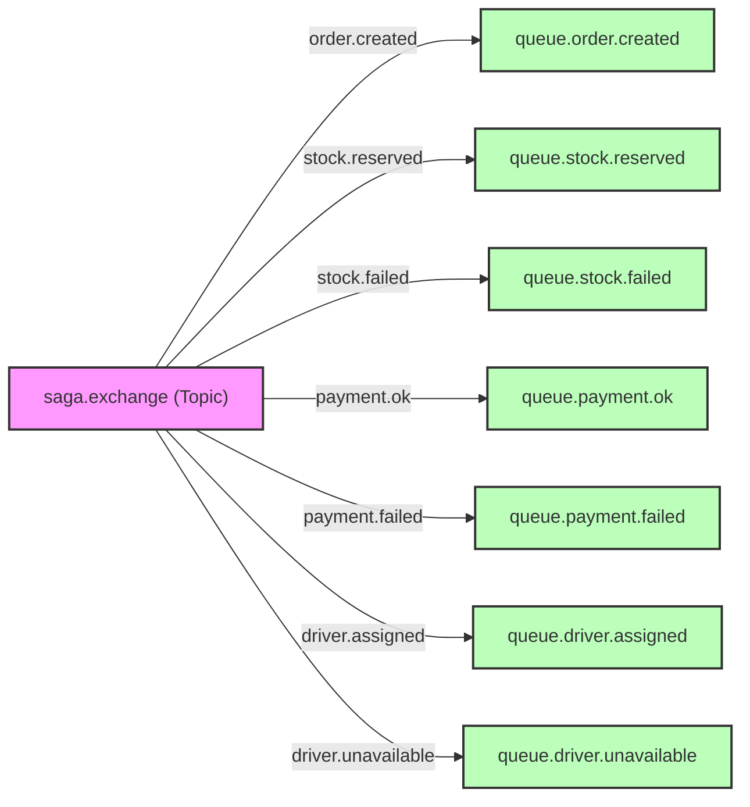

# 📨 Catálogo de Eventos y Mensajería — Ceiba-Bar Delivery v2

Este catálogo describe de forma precisa la arquitectura orientada a eventos, detallando la topología de **RabbitMQ** (para la coreografía del patrón Saga) y **Apache Kafka** (para el streaming en tiempo real), junto con los esquemas de datos JSON.

---

## 🐇 1. Topología de RabbitMQ (Patrón Saga)

RabbitMQ orquesta de manera asíncrona la consistencia eventual entre microservicios. Todos los exchanges son de tipo **Topic** (lo que permite enrutamiento flexible mediante routing keys).



### Tabla Maestra de Colas y Enrutamiento (Saga Coreography)

| Nombre de la Cola | Routing Key | Microservicio Productor | Microservicio Consumidor | Propósito / Reacción |
| :--- | :--- | :--- | :--- | :--- |
| **`queue.order.created`** | `order.created` | `micro-realtime` | `micro_products` | **Reservar Stock:** Verifica disponibilidad de inventario y crea una reservación temporal. |
| **`queue.stock.reserved`** | `stock.reserved` | `micro_products` | `micro_payments` | **Gatillar Cobro:** Si el stock está reservado, procede a preparar/confirmar la sesión de pago. |
| **`queue.stock.failed`** | `stock.failed` | `micro_products` | `micro-realtime` | **Cancelar Orden:** Si no hay stock, transiciona el pedido a estado `CANCELLED` directamente. |
| **`queue.payment.ok`** | `payment.ok` | `micro_payments` | `micro-drivers` | **Asignar Repartidor:** Si el cobro se completa con éxito, se busca y asigna un conductor disponible. |
| **`queue.payment.failed`** | `payment.failed` | `micro_payments` | `micro_products`, `micro-realtime` | **Liberar Stock / Cancelar:** Libera el stock retenido (compensación) y marca la orden como rechazada. |
| **`queue.driver.assigned`** | `driver.assigned` | `micro-drivers` | `micro-realtime` | **Preparar Pedido:** El conductor acepta el pedido, transiciona la orden a `PREPARING` e inicia simulación. |
| **`queue.driver.unavailable`** | `driver.unavailable`| `micro-drivers` | `micro_payments`, `micro_products`, `micro-realtime` | **Reembolsar y Cancelar:** Si no hay conductores, gatilla reembolso en Stripe/PayPal, libera stock y cancela. |

---

## 🗄️ 2. Esquemas de Datos de Eventos (RabbitMQ Payloads)

Todos los eventos transmitidos a través de RabbitMQ se envían serializados en formato JSON.

### A. Evento: Creación de Pedido (`order.created`)
*   **Payload JSON:**
    ```json
    {
      "orderId": 142,
      "customerId": 1,
      "items": [
        {
          "productId": 1,
          "productName": "Cerveza Ceiba Clara",
          "quantity": 2
        },
        {
          "productId": 5,
          "productName": "Papas Fritas",
          "quantity": 1
        }
      ]
    }
    ```

### B. Evento: Reserva de Stock Exitosa (`stock.reserved`)
*   **Payload JSON:**
    ```json
    {
      "orderId": 142,
      "reservationId": 883,
      "reservedAt": "2026-07-01T16:45:00.120Z",
      "expiresAt": "2026-07-01T16:55:00.120Z"
    }
    ```

### C. Evento: Pago Confirmado (`payment.ok`)
*   **Payload JSON:**
    ```json
    {
      "orderId": 142,
      "paymentId": 9942,
      "transactionId": "ch_3M41aBcDeFgHiJkL...",
      "amount": 165.0,
      "currency": "MXN",
      "gateway": "STRIPE",
      "paidAt": "2026-07-01T16:45:15.540Z"
    }
    ```

### D. Evento: Conductor Asignado (`driver.assigned`)
*   **Payload JSON:**
    ```json
    {
      "orderId": 142,
      "driverId": 24,
      "driverName": "Carlos Mendoza",
      "vehicleType": "MOTO",
      "licensePlate": "99ABC-8",
      "assignedAt": "2026-07-01T16:45:20.890Z"
    }
    ```

---

## ⚡ 3. Topología de Apache Kafka (Real-time Streaming)

Kafka se utiliza en `micro-realtime` para absorber de forma reactiva y con alto rendimiento las ráfagas de actualizaciones de coordenadas de geolocalización de los repartidores.

### Tema: `order-status-updates`
*   **Productor:** `micro-realtime` (el simulador GPS publica coordenadas en tiempo real).
*   **Consumidor:** `micro-realtime` (el `KafkaConsumerService` recibe las coordenadas y las reenvía a los clientes conectados vía WebSockets).
*   **Grupo de Consumidores:** `realtime-group`

> [!NOTE]
> A diferencia de RabbitMQ (que comunica microservicios distintos), Kafka se usa aquí como **bus interno reactivo** dentro del propio `micro-realtime`. Esto desacopla el hilo de simulación GPS (producción de coordenadas) del hilo de envío WebSocket (consumo y difusión al frontend), permitiendo absorber ráfagas de alta frecuencia sin bloquear el canal de comunicación con el cliente.
*   **Esquema de Payload JSON:**
    ```json
    {
      "orderId": 142,
      "status": "ON_THE_WAY",
      "driverId": "87564d-7a65-473e-b25c-dd19d6",
      "latitude": 19.432607,
      "longitude": -99.133209,
      "timestamp": 1782845135000
    }
    ```
